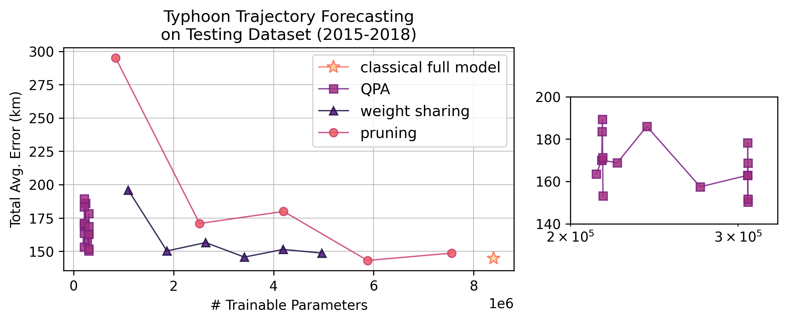
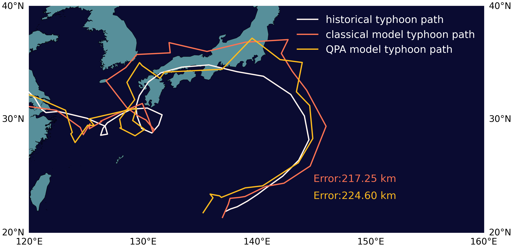

# Typhoon Trajectory Forecasting via Quantum-enhanced Parameter Efficient Learning


## Project Overview

This project explores the integration of Quantum Machine Learning (QML) with classical deep learning models to enhance typhoon trajectory forecasting. Leveraging the Quantum-Train (QT) framework and Quantum Parameter Adaptation (QPA), we demonstrate how quantum-assisted learning can significantly reduce the number of trainable parameters while maintaining high forecasting accuracy.

### Why This Matters
Taiwan, where Team QTX originates, is characterized by its steep and mountainous terrain, making it particularly vulnerable to extreme weather events. On average, the island experiences approximately 3.5 typhoons and dozens of torrential rainstorms each year, leading to significant infrastructure damage, agricultural losses, and disruptions to economic activity. These extreme weather events [result](https://nhess.copernicus.org/preprints/nhess-2022-38/) in an estimated annual economic loss of **374.3 million** Euros .

Given the devastating impact of typhoons in Taiwan and other regions worldwide, accurate trajectory prediction is crucial for effective disaster preparedness and mitigation efforts. However, traditional deep learning models for weather forecasting are computationally expensive, often requiring millions of parameters and substantial GPU resources. Our approach leverages QML techniques to significantly reduce trainable parameters during training and preserve the flexiblity to use this quantum-trained model pure classically while inference with high prediction accuracy, making advanced forecasting methods more accessible and efficient.

### Key Contributions

- ✅ **Quantum-Enhanced Training**: Applies QPA to traing deep learning models with significantly fewer parameters. 
- ✅ **Hybrid Quantum-Classical Approach**: Integrates QML techniques with the Attention-based Multi-ConvGRU model for efficient trajectory forecasting.
- ✅ **Scalability & Efficiency**: Reduces training complexity while maintaining prediction accuracy, making it feasible for real-world deployment.
- ✅ **Neutral Atom Compatibility**: Investigates implementation on Pasqal’s neutral atom quantum devices for future quantum hardware acceleration.


### How It Works
- **Classical Model Baseline**: We start with a strong classical deep learning model—Attention-based Multi-ConvGRU—that achieves high accuracy in typhoon trajectory prediction.

- **Quantum-Train (QT) Integration**: The QT framework is applied to generate trainable parameters efficiently, reducing overall model complexity.

- **Quantum Parameter Adaptation (QPA)**: Instead of training the full model, QPA adapts only the essential parameters (e.g., LoRA-based training).

- **Hybrid Optimization**: Classical gradient-based training is combined with quantum circuit learning to achieve optimal performance with fewer resources.

- **Pasqal Qadence Implementation**: Investigates how the QT and QPA framework can be adapted to Pasqal’s neutral atom quantum computing platform using Qadence.


<p align="center">
  <picture>
    
  </picture>
</p>

## Installation and setup guide 

1. Install the conda environment via the yaml file:
```
conda env create -f QPA_Typhoon_Trajectory.yaml
conda activate qttp
```
2. Download the ERA-Interim data from the google drive (https://drive.google.com/file/d/1o9oYyg6IUGIs_hT2wv8jnDfkJmhGRSQI/view?usp=sharing). The original data on the official site is currently unavailable, as you may observe here: https://apps.ecmwf.int/datasets/data/interim-full-daily/levtype=sfc/ 

3. Unzip the downloaded `z.zip` file, obtained the `z` folder and put it into `./data/ERA_Interim/` . Now you should have a folder like `./data/ERA_Interim/z`

4. run the file `data_processing.py` in the `./data` folder (This may cost more than 20 minutes. The data size is quite large, please prepare about 12G of space for this.).

5. Now you are ready! To run this project on a GPU, we recommend using a GPU with at least 10GB of VRAM.

## Example use cases
1. `QPA_ck_64_qnn_depth_20.ipynb`

    In this notebook, we demonstrate the end-to-end training and testing workflow for applying Quantum Parameter Adaptation (QPA)—a quantum-enhanced method—to efficiently train the classical ConvGRU model using only 2.57% of the original trainable parameters, while maintaining competitive performance.

2. `Classical_Model_baseline.ipynb`

    This notebook presents the pure classical training baseline for the original ConvGRU model, which consists of 8 million trainable parameters.

3. `Classical_Model_pruning_01.ipynb` and `Classical_Model_weight_sharing_1.ipynb`

    Since QPA is essentially a quantum-enhanced parameter-efficient learning method, we also compare it with two well-known classical neural compression techniques: pruning and weight sharing.
The comparison results are recorded and visualized in  `Plot_notebook_quantum_vs_classical_result_plot.ipynb`.  

<p align="center">
  <picture>
    
  </picture>
</p>

The picked prediction results of trajectories is plotted in `Plot_notebook_QPA_CMA_draw_map.ipynb`. 

<p align="center">
  <picture>
    
  </picture>
</p>

## Citation

The QPA method used in this work is proposed in the following paper. If you find it useful, we kindly recommend citing it using the BibTeX entry below:

```latex

@inproceedings{
liu2025a,
title={A Quantum Circuit-Based Compression Perspective for Parameter-Efficient Learning},
author={Chen-Yu Liu and Chao-Han Huck Yang and Hsi-Sheng Goan and Min-Hsiu Hsieh},
booktitle={The Thirteenth International Conference on Learning Representations},
year={2025},
url={https://openreview.net/forum?id=bB0OKNpznp}
}
```

The classical ConvGRU model used for typhoon trajectory forecasting to evaluate our Quantum Parameter Adaptation (QPA) method is proposed in the following work:

```latex
@inproceedings{xu2022am,
  title={AM-ConvGRU: a spatio-temporal model for typhoon path prediction},
  author={Xu, G., Xian, D., Fournier-Viger, P., Xutao, L, Yunming, Y, Xiuqing H},
  JO={Neural Computing and Applications},
  volume={34},
  pages={5905–5921},
  dio={https://doi.org/10.1007/s00521-021-06724-x}
  year={2022}
}
```

